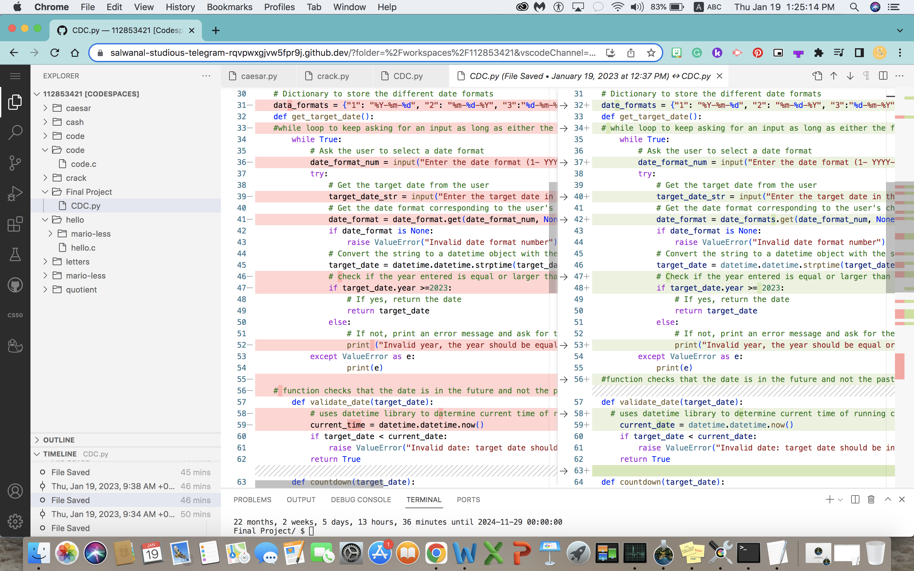
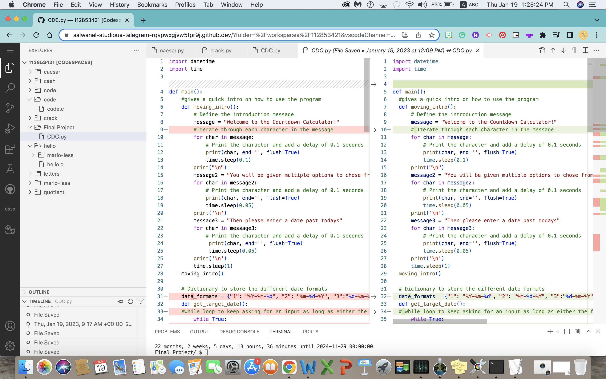
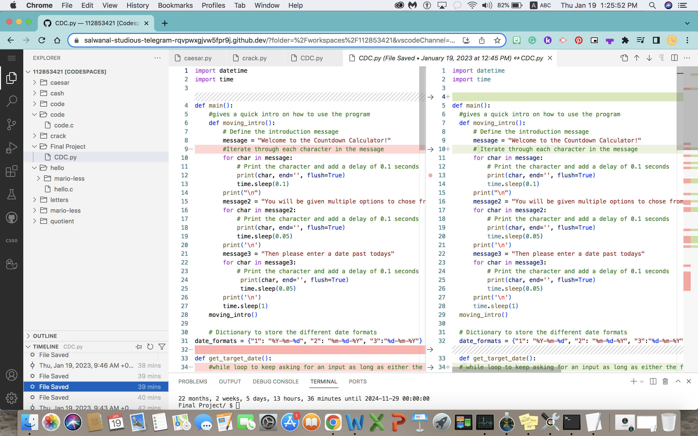
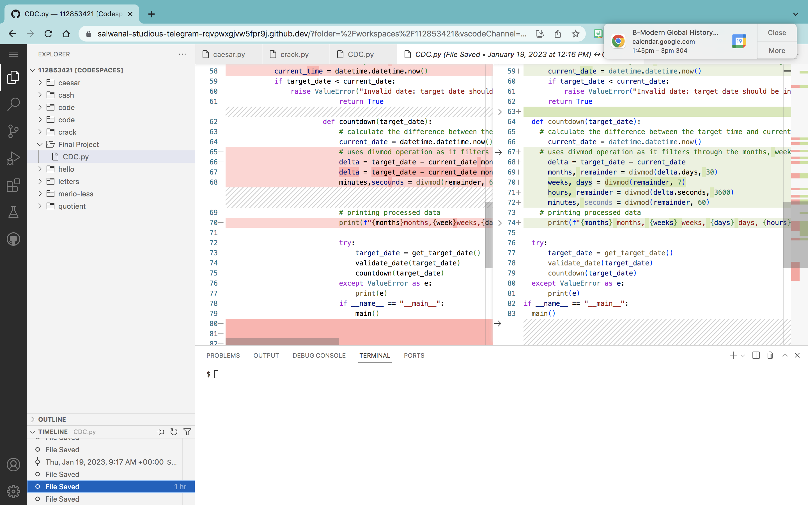
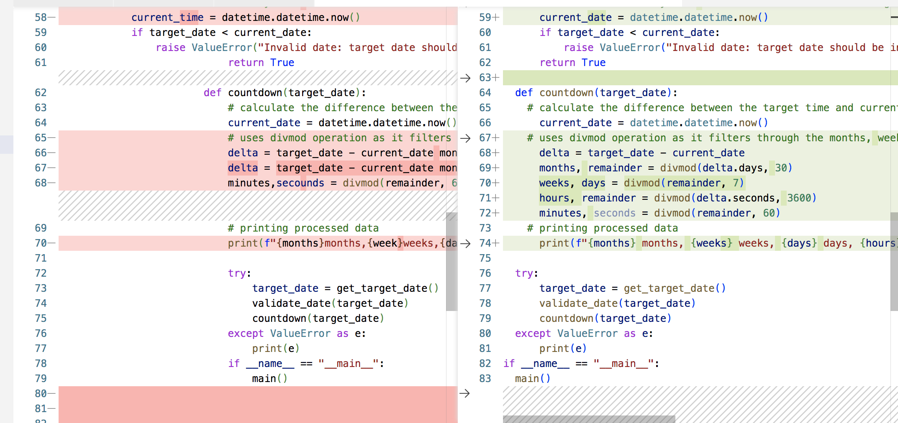

# countdown-calculator-
This software is a straightforward countdown counter that determines the amount of time until a target date in terms of months, weeks, days, hours, and minutes.

Run the script first before launching the software to get an introductory message. The software will then ask you to choose a date format from the list of available formats:

1: YYYY-MM-DD
2: MM-DD-YYYY
3: DD-MM-YYYY

After entering the corresponding number, choose the format in which to enter the target date. The application will then compute the amount of time left till the date after validating it to make sure it is in the future and not the past.

My big breakthrough moment was when I was finally able to get the different styles of dates working as before I was using a completely different system to count down and this required me changing around a lot of my code.

Error Handling: The application has error handling for target dates that have passed and incorrect date formats. In the event of a mistake, the application will prompt the user for input once again and display an error message.

Dependencies: The Python standard library's datetime and time modules are used by this application.

# Timeline

